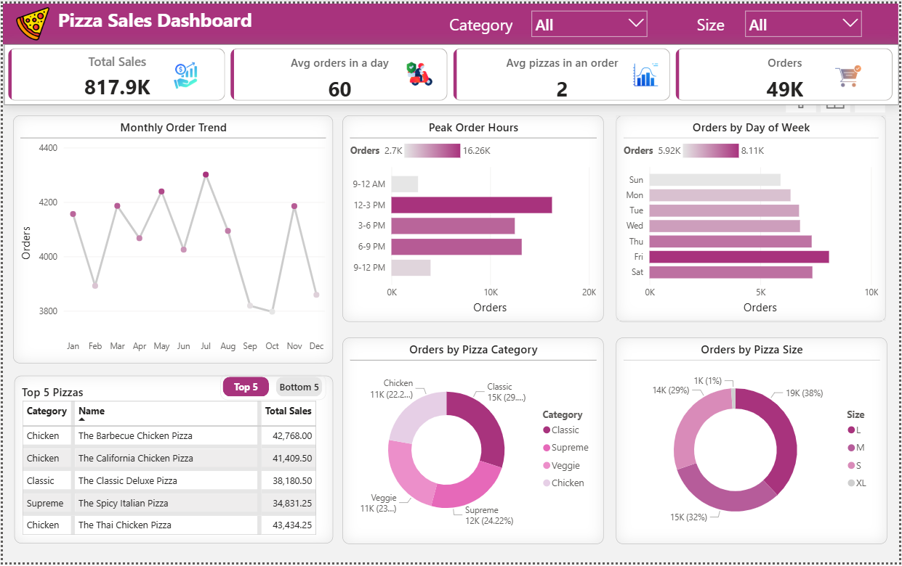

# 🍕 Pizza Sales Analysis (SQL + Power BI)

## 📌 Project Overview

This project analyzes pizza sales data using **SQL for data analysis** and **Power BI for interactive visualization**.
The objective is to identify key business insights such as sales trends, product performance, customer ordering behavior, and peak demand hours.

The project demonstrates practical **data analytics skills including SQL querying, data modeling, and dashboard development**.

---

## 📊 Dashboard Preview



---

## 🧠 SQL Analysis

SQL was used to explore the dataset and extract business insights from the pizza sales database.
The analysis was structured into **three stages: Basic, Intermediate, and Advanced analysis**.

### Basic Analysis

The initial analysis focused on understanding the overall sales performance.

* Calculated the **total number of orders placed**
* Computed the **total revenue generated from pizza sales**
* Identified the **highest priced pizza**
* Determined the **most commonly ordered pizza size**
* Retrieved the **top 5 most ordered pizza types**

These queries primarily used **JOIN operations and aggregate functions such as `COUNT()`, `SUM()`, and `GROUP BY`**.

---

### Intermediate Analysis

This stage explored customer ordering patterns and product distribution.

* Calculated the **total quantity of pizzas ordered by category**
* Analyzed the **distribution of orders by hour of the day**
* Examined the **number of pizzas available within each category**
* Calculated the **average number of pizzas ordered per day**
* Identified the **top 3 pizzas based on total revenue**

This level involved **multi-table joins, aggregations, and subqueries**.

---

### Advanced Analysis

Advanced SQL techniques were used to generate deeper insights.

* Calculated the **percentage contribution of each pizza type to total revenue**
* Analyzed **cumulative revenue growth over time using window functions**
* Identified the **top 3 pizzas by revenue within each pizza category** using **CTEs and ranking functions**

These queries demonstrate the use of:

* Window Functions (`OVER()`)
* Ranking Functions (`RANK()`)
* Common Table Expressions (CTE)

SQL file used in this project:

```
pizza_sales_analysis.sql
```

---

## 📊 Power BI Dashboard

The insights generated through SQL analysis were visualized using **Power BI** to build an interactive dashboard.

The dashboard includes:

* KPI cards for **Total Sales, Orders, and Average Metrics**
* **Monthly Order Trend** analysis
* **Peak Ordering Hours**
* **Orders by Day of Week**
* **Top 5 Best Selling Pizzas**
* **Revenue Distribution by Pizza Category**
* **Orders by Pizza Size**
* Interactive slicers for **Category and Size filtering**

This allows users to easily explore sales trends and customer behavior.

---

## 🔍 Key Insights

Key insights derived from the analysis:

* **Classic pizzas generate the highest revenue**
* **Large size pizzas are the most frequently ordered**
* Peak ordering hours occur between **12 PM – 6 PM**
* **Friday and Saturday** experience the highest order volume

These insights can help businesses optimize **menu strategy, staffing, and marketing decisions**.

---

## 🛠 Tools & Technologies

* **SQL Server** – Data analysis
* **Power BI** – Dashboard creation
* **DAX** – KPI calculations
* **Data Modeling** – Table relationships

---

## 📁 Repository Structure

```
pizza-sales-analysis-sql-powerbi
│
├── data
│   ├── orders.csv
│   ├── order_details.csv
│   ├── pizzas.csv
│   └── pizza_types.csv
│
├── pizza_sales_analysis.sql
├── pizza_sales_dashboard.pbix
├── pizza_sales_dashboard.png
└── README.md
```

---

## 👩‍💻 Author

**Sakshi Grover**

Aspiring Data Analyst with skills in **SQL, Power BI, and Data Visualization**, focused on transforming data into meaningful business insights.
